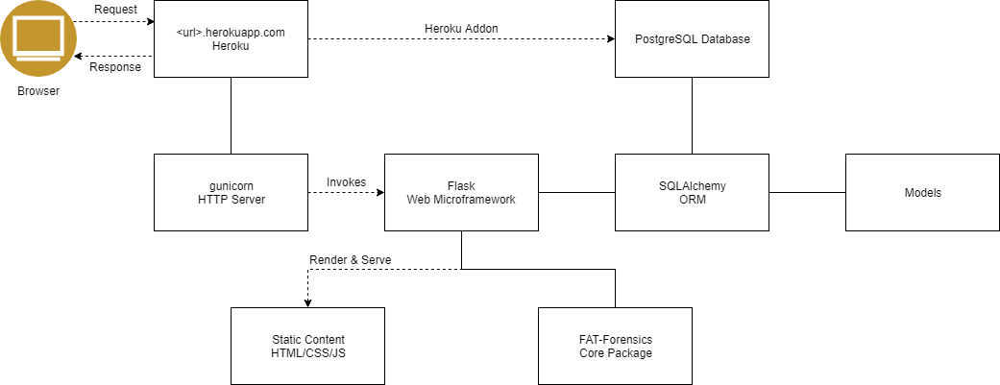
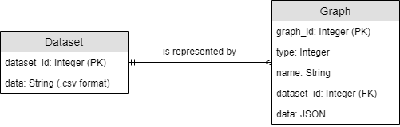
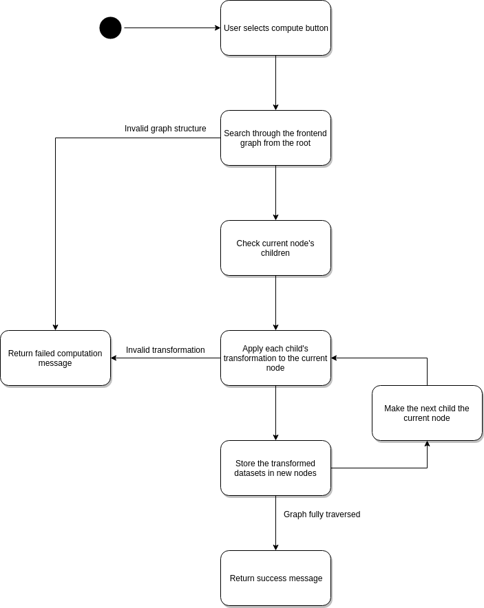

# OO Design & UML

## High-Level



## UML Examples

Static Example: the models **Dataset** and **Graph**:

<div align="center">
    


</div>

The structure of each graph represents how a dataset is transformed by functions beginning from the root: each node represents the current state of the dataset following a transformation. A graph can only represent exactly **one** dataset, so the relationship between **Dataset** and **Graph** is one-to-many.

A design choice we made is that the frontend *does not* store the dataset at all, and transformations are applied on the back end. This is why the Graph is represented merely using JSON and a reference to the dataset. If we chose to store the dataset alongside the graph, graphs would become extremely heavy (some datasets are thousands of datapoints long), and lots of data would be repeated.

Dynamic Example: computing the transformed datasets from a graph:

<div align="center">



</div>

Each edge in the graph represents a transformation on the dataset, but it needs to be converted from the frontend representation to a concrete Python object. The frontend graph is traversed starting from the root node, and each function is applied to the dataset to produce a new node. This process is repeated until the whole frontend graph is transformed into a Python object, complete with transformed datasets. If at any point the computation fails (e.g. if two computations are not compatible with each other), then computation stops and the user is informed.

The graph could be eagerly evaluated, i.e. evaluated as the user continues to add nodes, which would allow for responsive feedback on whether the computation is valid. However, it would result in redundant computation, especially if the user has not completed their graph structure. Therefore, we opted for a 'compute' button so that the graph is only evaluated when the user wants.

## Flask & Python

The core package which the client is giving us is written in Python, so we chose to use Python for our backend instead of Java. If we used Java we'd have to write all the bindings for the package which could take some time and add unecessary complexity to the task. Our client also said that they would like us to use Python over Java as they are more familiar with programming in Python.

For our RESTful API framework we decided to use **Flask**. Flask is a 'microframework', which means that it is very lightweight and easy to use, but does not provide extensive functionality. **Django** is another alternative that we considered, but we felt that it was:

* Too bulky (compared to **Flask** being a lot more lightweight), our actual website isn't that large so we don't need a full stack solution.
* Too much to learn. **Flask** is small and 'one-use'. We make up for the lack of full-stack support by using **Flask** extensions (e.g. **Flask-SQLAlchemy**).

Flask's default HTTP server runs on **Werkzeug**; a fine choice for development, but it is not efficient enough at large scales in production. Two popular alternative choices are **NGINX** and **gunicorn** (sometimes even both together). Flask and gunicorn are **WSGI** (Web Server Gateway Interface) compliant, while **NGINX** is not - therefore, we chose to use **gunicorn** to invoke our Flask application. 

## Database

We use **PostgreSQL** for our database - **Heroku** uses an *ephemeral filesystem*<sup>1</sup> (i.e. any files written are deleted the moment the dyno is stopped/restarted). This makes **SQLite** unsuitable as it works on memory and you'd lose your database every 24 hours or so, as opposed to Postgres which works over multiple dynos.

In addition, Heroku also has great support for **PostgreSQL**.

## ORM

We decied to use an ORM because they manage the SQL driver for us, so we don't need to deal with driver specific syntax and types. Using an ORM also means that we don't have to write any SQL, making our system more secure, and there's a one-to-one mapping between the data in our program and the data stored in the database. We chose **SQLAlchemy** over other ORMs since it has a nice binding with **Flask** in a package called **Flask-SQLAlchemy**.

For example, here's the model which represents the **Graph** table in the database:
```python
# models.py

db = SQLAlchemy()

class Graph(db.Model):
    graph_id = db.Column(db.Integer, primary_key=True)
    type = db.Column(db.Integer, nullable=False)
    name = db.Column(db.String, nullable=False)
    dataset = db.Column(db.Integer, db.ForeignKey('dataset.dataset_id'))
    data = db.Column(db.JSON, nullable=False)
```

## Graph Library

Our graphs are powered by **Cytoscape.js**, a frontend library for generating graph networks. Cytoscape boasts great features such as:

* Cross-platform using HTML canvas.
* Native exporting to JSON so the user can save or download the graph.
* Large extension pool and easily modifiable.
* Automatic layouts which position nodes in a preset structure.
* Customisable events on each part of the graph.

Cytoscape renders on the frontend using a HTML canvas, which puts more pressure on the user's device, especially with incredibly large graphs. Since the tool is research-oriented, our client told us to only target the desktops and ignore mobile/tablet users. Therefore, most users will have no problem running the tool.

We tested other libraries such as **Sigma.js**, but found that it both runs worse than Cytoscape and lends itself more to densely connected networks rather than a directed graph structure. **D3** was also an option, but we found that D3 is much more generic than Cytoscape and, like Sigma.js, better for dense networks.

Unfortunately, Cytoscape is a large library (1MB+ including other extensions) which could negatively affect the load times of the page. In 2016, the average website had an average script size of 357kb<sup>2</sup>, so we plan to reduce the size of our scripts by using compression and a build tool to bundle the scripts together. 

## References
1. https://devcenter.heroku.com/articles/dynos#ephemeral-filesystem
2. https://www.keycdn.com/support/the-growth-of-web-page-size