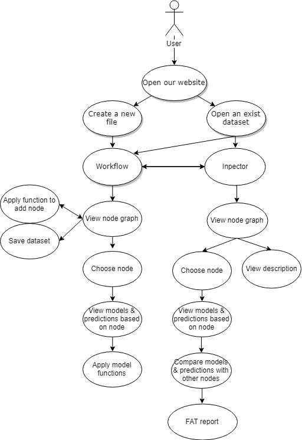

# Overview
The core FAT package was developed by researchers at the University of Bristol, with sponsorship from Thales UK. 

Our client would like to work with us to investigates the Fairness, Accountability, and Transparency (FAT) of predictive algorithms. This is the front and back end for a web application which will connect to FAT. It can load datasets into a database, retrieve existing datasets, display and compare data points, generate metrics which evaluate ML fairness, accountability, and transparency metrics, provide interactive plots, and export these reports into PDFs.

Our goal is to democratise assessing social aspects and potentially detrimental effects of predictive models by providing an open source Python package licensed under BSD3 with easy to use Application Programming Interface (API) and minimal dependencies (SciPy and Numpy). The package is intended to be easily integrable with scikit-learn: the most popular and leading open source Python package for doing ML. With the abundance of novel FAT methods, a common open source framework could lower the entry barrier to this research field. Just like scikit-learn allows non-experts to fiddle around with state-of-the-art ML algorithms, we hope that the software framework that is the outcome of our research could allow a broader AI community and lay ML users to test and evaluate their algorithms for security issues, biases, discriminations and unexpected behaviour.

Our key problem is that poorly informed AI system through lack of data can negatively impact the reliability of AI functions. Our tool should be used to represent and analyse these impacts and apply functions on given datasets to try and create more reliable results.
# Requirements

##Stakeholders:

When creating a research tool of this type, it is very important to keep our stakeholders in mind. Our users' experience with the product must be seamless and straight-forward as misinterpreting the data recieved may have severe knock-on effects to future research or development of a product. This could then negatively impact the consumers of products affected by research using our tool.
As well as this we must take into account investor and future development of our tool so we must create clean and efficient code that is understandable and logically neat.

### Developers

it is of upmost importance that if a developer plans to release a feature than recognises patterns in human interaction that the results are consistent across any one person that is using. For example a facial recogistion app - if the app is unreliable for users of particular races then it could heavily hinder the trust put in the product by its consumers and give the company a bad name.

### Consumers of Minority Groups

When creating ai features, companies usually use more the more abundant subculture of the area. this can lead to inaccurate results for people of the minorities that are not rfairly represented in the machine learningdatasets. this would quite frankly be an insult to a person who has invested their money into a product.

### Investors and Future Developers

We must create a clean work environment in effort to make the investors of Anthopometrics pleased with their invesment and want to keep backing the research of our client. This is also important to accommodate for future development on our product after we have finished.

### Researchers

Researchers may wish to see the connetations of less informed ai systems based on the (lack of) information we give it. With data this intricate and complex, it can be very hard to understand and take useful information from it. This leaves the job to us to create a sophisticated way of representing the data for ease of use.



##Functional Requirements

The goal of the project is for researchers to easily assess and investigate social aspect of their predictive models. To help with this, we must comply to the following functional requirements:

- Ability to upload a dataset.
- Ability to load previously saved datasets.
- Ability to perform function on dataset from given pythn package to create new, altered dataset.
- Ability to name altered dataset along with a description.
- Ability to revert to older versions of said dataset without deleting later versions.
- Ability to view models and predictions based on current chosen dataset.
- Ability to manupulate graph views to see more details on area of interest.
- Ability to enter "inspector view" where it is possibble to compare datasets and view fairness analytics based on data in set after functions applied along with comparisons with other sets.
- Ability to export reports into pdf files.
- On screen guidance and logically organise for ease of use and readability.
- Ability to save datasets.

##Non-Functional Requirements

- It should have a user-friendly interface. Google have released a plugin called "what-if tool", for their TensorFlow visualisation framework called TensorBoard. It is similar with our project but it has a limitation of interacting only with TensorFlow models. We want to have larger audience and higher impact so we are making our project clear to use and the overall design should be simple but professional. This is the goal that we believe to be most paramount as we must ensure that researchers can use our product efficiently and easily to eliminate mistakes when handling important data, and that it is a more useful experience than the "what-if" tool.
- Since we have lots of graphs and data appear on our interface and our user would mainly choose to use a tablet for this, we won't implement a smartphone version for the project.
- The project should be able to be updated or changed to meet client's requirements.
- The system can only be changed by the admins of the project and all the data must be kept safe so they are not suspected, or disputed.
- The size of the project cannot be too large because we don't want it to be super slow when we load data. We should compress and tidy our code to minimise loading time.
# OO Design & UML

## High-Level

Fill me in!

## Flask & Python

The core package which the client is giving us is written in Python, so we chose to use Python for our backend instead of Java. If we used Java we'd have to write all the bindings for the package which could take some time and add unecessary complexity to the task. Our client also said that they would like us to use Python over Java as they are more familiar with programming in Python.

For our RESTful API framework we decided to use **Flask**. Flask is a 'microframework', which means that it is very lightweight and easy to use, and does not provide extensive functionality. Therefore, Flask alone is not suitable for deployment, so we needed to also use **gunicorn** on Heroku to act as a WSGI server for Flask.

**Django** is another alternative that we considered, but we felt that it was:

* Too bulky (compared to **Flask** being a lot more lightweight), our actual website isn't that large so we don't need a full stack solution.
* Too much to learn. **Flask** is small and 'one-use'. We make up for the lack of full-stack support by using **Flask** extensions (e.g. **Flask-SQLAlchemy**).

## Database

We use **PostgreSQL** for our database - Heroku uses an *ephemeral filesystem*<sup>1</sup> (i.e. any files written are deleted the moment the dyno is stopped/restarted). This makes **SQLite** unsuitable as it works on memory and you'd lose your database every 24 hours or so, as opposed to Postgres which works over multiple dynos.

In addition, Heroku also has great support for **PostgreSQL**.

## ORM

We decied to use an ORM because they manage the SQL driver for us, which means that we don't need to deal with driver specific syntax and types. Using an ORM also means that we don't have to write any SQL, making our system more secure, and there's a one-to-one mapping between the data in our program and the data stored in the database. We chose **SQLAlchemy** over other ORMs since it has a nice binding with Flask in a package called **Flask-SQLAlchemy**.

For example, here's the model which represents the **Graph** table in the database:
```python
# models.py

db = SQLAlchemy()

class Graph(db.Model):
    graph_id = db.Column(db.Integer, primary_key=True)
    type = db.Column(db.Integer, nullable=False)
    name = db.Column(db.String, nullable=False)
    dataset = db.Column(db.Integer, db.ForeignKey('dataset.dataset_id'))
    data = db.Column(db.JSON, nullable=False)
```

## Graph Library

Our graphs are powered by **Cytoscape.js**, a frontend library for generating graph networks. Cytoscape boasts great features such as:

* Cross-platform using HTML canvas.
* Native exporting to JSON so the user can save or download the graph.
* Large extension pool and easily modifiable.
* Automatic layouts, meaning we don't have do manually define the position of each node.
* Customisable events on each part of the graph.

Cytoscape renders on the frontend using a HTML canvas, which does mean that we rely on the library either being lightweight or the user having sufficient hardware to run it. Since the tool is research-oriented, our client told us to only target the desktop platform and ignore mobile/tablet users, which means that most if not all of our users can run Cytoscape. 

We tested other libraries such as **Sigma.js**, but found that it both runs worse than Cytoscape and lends itself more to densely connected networks rather than a directed graph structure. **D3** was also an option, but we found that D3 is much more generic than Cytoscape and, like Sigma.js, better for dense networks.

Unfortunately, Cytoscape is a large library (1MB+ including other extensions) which could negatively affect the load times of the page. In 2016, the average website had an average script size of 357kb<sup>2</sup>, so we plan to reduce the size of our scripts by using compression and a build tool to bundle the scripts together. 

## References
1. https://devcenter.heroku.com/articles/dynos#ephemeral-filesystem
2. https://www.keycdn.com/support/the-growth-of-web-page-size
# Testing

## Backend

Our backend runs **Flask**, which uses Python. To test this, we use:

* **Pytest** (to test specific assertions)
* **Pylint**; (to test if the program compiles, and if a consistent coding style is used)

A **database** (PostgreSQL) is used alongside Flask, which is also primitively tested (insertion/deletion/format of data).

## Frontend

The frontend is mostly **JS**. There are a few aspects which we can test:

We run **Selenium** on CircleCI to test the usability of the site - it can simulate button activations.

Using **Jest**, we write some unit tests for the graph library we use, **INSERT**. These verify that basic functionality works (i.e. adding/deleting nodes).

We could test how the site looks, but we decided against it since changes to the UI are often and sometimes very slight, making it difficult to keep the tests current.

## Testing Workflow

In all, our testing workflow relies on:

* **Local** user testing
* Tests ran on **CircleCI** (during which: all python modules are reinstalled; the database is reset (i.e. a 'clean slate'))


This assures us that our code works on more than just one machine.

### Why CircleCI?

We looked at different methods of CI and decided on CircleCI because of its **ease of use** and **speed of setup**. We found that **Jenkins** took a lot of setup, including hosting it on our own server, wheras with CircleCI we can operate cloud-based on their servers. **TravisCI** was another contender but ultimately we wanted the ability to deploy our site to Heroku all in one platform.

TODO:

[] Integration tests?
[] Change tense?
