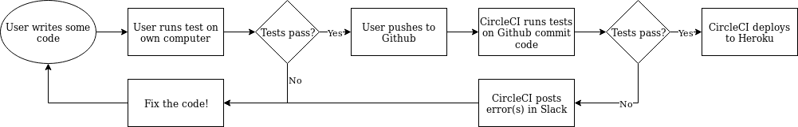

# Overview
The core FAT package was developed by researchers at the University of Bristol, with sponsorship from Thales UK. 

Our client would like to work with us to investigates the Fairness, Accountability, and Transparency (FAT) of predictive algorithms. This is the front and back end for a web application which will connect to FAT. It can load datasets into a database, retrieve existing datasets, display and compare data points, generate metrics which evaluate ML fairness, accountability, and transparency metrics, provide interactive plots, and export these reports into PDFs.

Our goal is to democratise assessing social aspects and potentially detrimental effects of predictive models by providing an open source Python package licensed under BSD3 with easy to use Application Programming Interface (API) and minimal dependencies (SciPy and Numpy). The package is intended to be easily integrable with scikit-learn: the most popular and leading open source Python package for doing ML. With the abundance of novel FAT methods, a common open source framework could lower the entry barrier to this research field. Just like scikit-learn allows non-experts to fiddle around with state-of-the-art ML algorithms, we hope that the software framework that is the outcome of our research could allow a broader AI community and lay ML users to test and evaluate their algorithms for security issues, biases, discriminations and unexpected behaviour.

Our key problem is that this is a back- and front-ends package and we have to work alongside AI and ML to create a user-facing interface that can potentially impact how research in AI fairness, accountability and transparency is done. After further discussion, we concluded to.....
# Requirements
Stakeholders: 

The foremost stakeholders are the academic researchers, ML enthusiasts and developers who will use it to easily assess and investigate social aspect of their predictive models.
# OO Design & UML
# Testing

## Backend

Our backend runs **Flask**, which uses Python. To test this, we use:

* **Pytest** (to test specific assertions)
* **Pylint**; (to test if the program compiles, and if a consistent coding style is used)

A **database** (PostgreSQL) is used alongside Flask, which is also primitively tested (insertion/deletion/format of data).

## Frontend

The frontend is mostly **JS**. There are a few aspects which we can test:

We run **Selenium** on CircleCI to test the usability of the site - it can simulate button activations.

Using **Jest**, we write some unit tests for the graph library we use, **INSERT**. These verify that basic functionality works (i.e. adding/deleting nodes).

We could test how the site looks, but we decided against it since changes to the UI are often and sometimes very slight, making it difficult to keep the tests current.

## Testing Workflow

In all, our testing workflow relies on:

* **Local** user testing
* Tests ran on **CircleCI** (during which: all python modules are reinstalled; the database is reset (i.e. a 'clean slate'))

This assures us that our code works on more than just one machine.

### Why CircleCI?

We looked at different methods of CI and decided on CircleCI because of its **ease of use** and **speed of setup**. We found that **Jenkins** took a lot of setup, including hosting it on our own server, wheras with CircleCI we can operate cloud-based on their servers. **TravisCI** was another contender but ultimately we wanted the ability to deploy our site to Heroku all in one platform.

TODO:

[] Integration tests?
[] Change tense?
