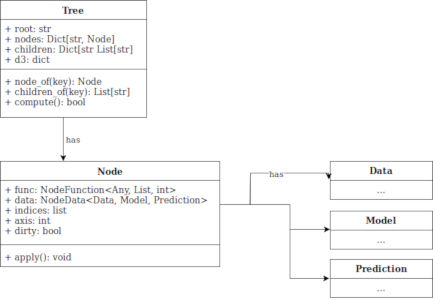

# OO Design & UML

## High-level Architecture Diagram

For our RESTful API framework, we decided to use **Flask**. Flask is a 'microframework', which means that it is very lightweight and easy to use, but does not provide extensive functionality. **Django** is another alternative that we considered, but it's oriented at highly database driven websites. Flask is much smaller scale, and we can make up for any lack of functionality by using extensions.

Flask's default HTTP server runs on **Werkzeug**; a fine choice for development, but it is not efficient enough at large scales, i.e. production. To remedy this, we used **Gunicorn** to hook into the Flask application and run the web application. This is possible because Flask is **Web Server Gateway Interface** (**WSGI**) compliant. We could have additionally added **Nginx** in front of **Gunicorn**, a reverse proxy which would handle the routing and static file serving, but we felt that for the scope of the project, this was an unnecessary addition.

We used React because a team member already had experience with it, and it allows us to develop stateful, reusable components, which suits our application well. The graph is rendered using D3 and a third-party package which combines React and D3; this was required because D3 and React have conflicting ways of manipulating the DOM. To compile the frontend code, we used Webpack and Babel which allowed us to use modern Javascript (ES6) features without worrying about compatibility issues.

## Static UML Model

We need to pass data between the front-end and back-end and be able to manipulate it on both sides. D3 stores the data in a pure dictionary format (nodes and their links) - we had to decide if it was best to work directly on the D3 format or transform it into another format.

We decided to convert the D3 dictionary into an internal structure called Tree. This allows us to implement more specialist, reusable operations instead of a wrapper over the dictionary. Each time we receive a graph for execution from the user, it is transformed into a Tree using the `build_tree` function. This could cause an overhead when converting many or large graphs. However, the D3 graph format is difficult to traverse, and converting it first makes it easier to perform operations such as depth-first searches and finding nodes.

Converting the graph into a common format means we condense all the front-end dependency into one conversion function called `build_tree`, allowing us to more easily swap out the front-end or update the conversion function with newer versions. The trees are stored by serialisation (pickling), which allows us to store the DMP alongside the tree in one file. 

Even though there is a speed trade-off in storing our data in a Tree, it enables our code to be more concise and readable. It also allows the format of the frontend graph to change without affecting the core Tree code; all that needs to be updated is the `build_tree` function. From this model we learned that code readability and ease of use is in many cases better than a small increase in speed.

## Dynamic UML Model

After selecting a node, the user can open the ‘inspect’ view to look at charts relating to the node’s data. The inspect view is split up into tabs for each of the FAT aspects, with different charts for each tab; the charts shown also depend on the current mode (e.g. histogram for fairness & data). We needed a way to transform the node’s data into all available charts.

We chose to depend on the server for the serving of all chart types and the generation of individual chart images & text. The main motivator behind this was that the data returned by the FAT-Forensics package is in numpy form, making it perfect for matplotlib. We could have downloaded the data and then generated charts on the client side, which, whilst being more interactive for the client, it would have been less flexible and require more data to be exchanged between the server and client. This also gives us the ability to dynamically choose which charts are shown and adjust what charts look like purely on the server side.

The possible chart types were chosen to be downloaded separately to the actual chart images and texts. It might have been better to combine both to reduce the number of requests from the client to server, but this allows us to display the chart title and possible arguments before the svg/text is loaded, as well as an error message/loading animation for individual charts. We also chose to download the possible chart types per mode rather than mode **and** tab to reduce the number of overall requests.

Whilst the generation of charts and separation of requests increased the required communication between client and server, it gave us more flexibility and power on the server’s side. The client can be ignorant of the size of the data and how it is formatted, and focus on displaying the charts. Overall, this helped us understand the benefits of separating requests and data.